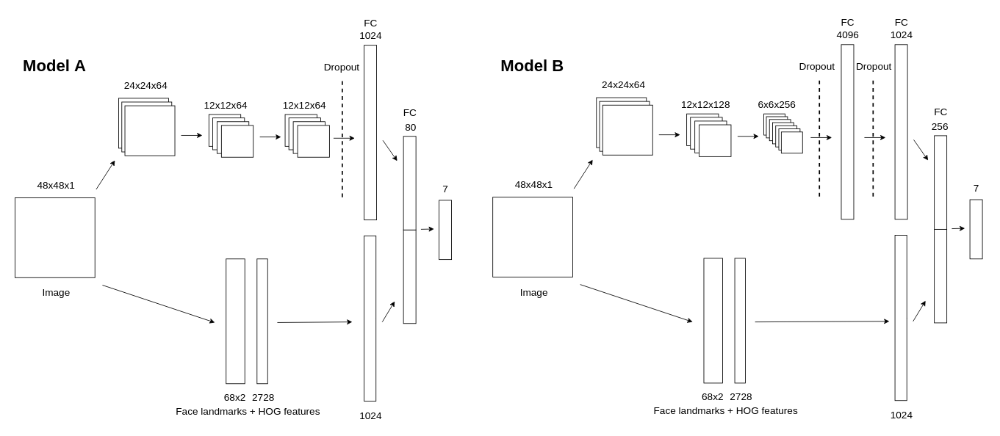
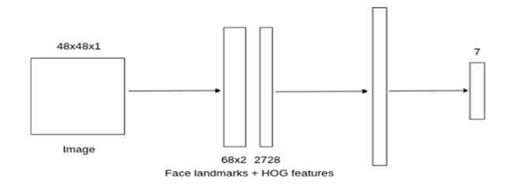
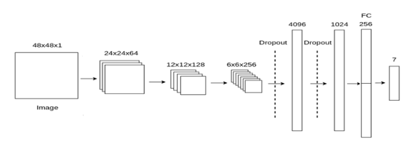
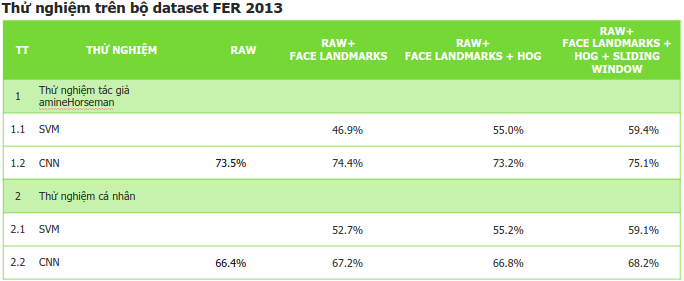
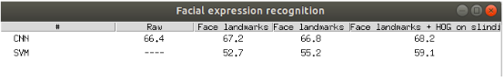
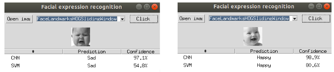

# Nhận dạng cảm xúc khuôn mặt sử dụng phương pháp SVM v
Hôm nay mình sẽ giới thiệu cho các bạn về chủ đề nhận dạng cảm xúc qua khuôn mặt, sử dụng 2 phương pháp chính là SVM và CNN.
Mục tiêu của bài viết:
+ So sánh phương pháp SVM và CNN trong nhận dạng cảm xúc qua khuôn mặt.
+ So sánh phương pháp CNN cơ bản và CNN cơ bản kết hợp các đặc trưng truyền thống.

Để làm rõ 2 mục tiêu trên, mình sẽ giới thiệu mô hình kiến trúc mình triển khai (Mô hình này mình đã tìm hiểu và tham khảo bài báo: [[Facial Expression Recognition using Convolutional Neural Networks: State of the Art, Pramerdorfer & al. 2016]](https://arxiv.org/abs/1612.02903) - Đây là bài báo uy tin, được đăng lên tạp chí nổi tiếng và tới thời điểm hiện tại có 71 bài báo khác tham chiếu + tham khảo đến nó)

Mô hình CNN kết hợp đặc trưng truyền thống cho hệ thống nhận dạng cảm xúc qua khuôn mặt


Mô hình SVM thiết kế cho hệ thống nhận dạng cảm xúc qua khuôn mặt


Mô hình CNN cơ bản thiết kế cho hệ thống nhận dạng cảm xúc qua khuôn măt


Sau khi thực hiện triển khai mô hình, và thực hiện cài đặt, ta được kết quả dưới đây :


-> Nhìn vào bảng kết qủa ta đã chứng tỏ được kết quả mục tiêu thực hiện.


1. Thực hiện cài đặt thư viện hỗ trơ :
- Tensorflow
- Tflearn
- Numpy
- Argparse
- [optional] Hyperopt + pymongo + networkx
- [optional] dlib, imutils, opencv 3
- [optional] scipy, pandas, skimage

2. Download Fer2013 dataset và Face Landmarks model

    - [Kaggle Fer2013 challenge](https://www.kaggle.com/c/challenges-in-representation-learning-facial-expression-recognition-challenge/data)
    - [Dlib Shape Predictor model](http://dlib.net/files/shape_predictor_68_face_landmarks.dat.bz2)

2. Giải nén files download

    Đưa các file `fer2013.csv` & `shape_predictor_68_face_landmarks.dat` vào trong folder root.

3. Thực hiện convert dataset để trích xuất các đặc trưng truyền thống Face Landmarks và HOG Features
- Cài đặt CNN

    You can also use these optional arguments according to your needs:
    - `-j`, `--jpg` (yes|no): **save images as .jpg files (default=no)**
    - `-l`, `--landmarks` *(yes|no)*: **extract Dlib Face landmarks (default=yes)**
    - `-ho`, `--hog` (yes|no): **extract HOG features (default=yes)**
    - `-hw`, `--hog_windows` (yes|no): **extract HOG features using a sliding window (default=yes)**
    - `-hi`, `--hog_images` (yes|no): **extract HOG images (default=no)**
    - `-o`, `--onehot` (yes|no): **one hot encoding (default=yes)**
    - `-e`, `--expressions` (list of numbers): **choose the faciale expression you want to use: *0=Angry, 1=Disgust, 2=Fear, 3=Happy, 4=Sad, 5=Surprise, 6=Neutral* (default=0,1,2,3,4,5,6)**


    Bạn lựa chọn các tham số mong muốn, ở đây mình lựa chọn 5 trạng thái cảm xúc chính với lý do 5 cảm xúc này có nhiều dữ liệu trong bộ FER2013
    - Defaul: python convert_fer2013_to_images_and_landmarks.py
    - RAW:  python convert_fer2013_to_images_and_landmarks.py --landmarks=no --hog=no --hog_windows=no --jpg=yes --onehot=yes  --expressions=0,3,4,5,6
    - Landmarks: python convert_fer2013_to_images_and_landmarks.py --landmarks=yes --hog=no --hog_windows=no --jpg=no --onehot=yes  --expressions=0,3,4,5,6
    - Landmarks + HOG: python convert_fer2013_to_images_and_landmarks.py --landmarks=yes --hog=yes --hog_windows=no --jpg=no --onehot=yes  --expressions=0,3,4,5,6
    - Landmarks + HOG + Sliding window: python convert_fer2013_to_images_and_landmarks.py --landmarks=yes --hog=yes --hog_windows=yes --jpg=no --onehot=yes  --expressions=0,3,4,5,6
    **Note: chú ý đến các đường dến để lưu file khi convert trong file parameters.py
  THực hiện quá trình trainning   
    
**Thực hiện training: Chú ý, khi convert xong, ta phải thực hiện training cho từng các thông số mà bạn đã lựa chọn bên trên để convert **
-Chạy run file:
```
python train.py --train=yes
```
- Train and evaluate:
```
python train.py --train=yes --evaluate=yes
```
Note: Chú ý đến trường save_model_path trong file parameter

Cài đặt Optimize training hyperparameters
```
pip install hyperopt, pymongo, networkx
```
```
python optimize_hyperparams.py --max_evals=20
```

Cuối cùng Predict tâm trạng
```
python predict.py --image path/to/image.jpg
```
-Tương tự cho SVM, chú ý đến tên file.

Cuối cùng sau khi training xong hết, thì ta chạy lần lượt các file: main.py, main_image.py, main_video.py
Kịch bản kiểm thử:
1 Thử nghiệm trên bộ dataset FER 2013

2 Thử nghiệm trên 1 ảnh bất kỳ trong bộ dataset FER2013

3. Thử nghiệm trực tiếp qua camera
Các bạn cứ chạy nhá, do m


